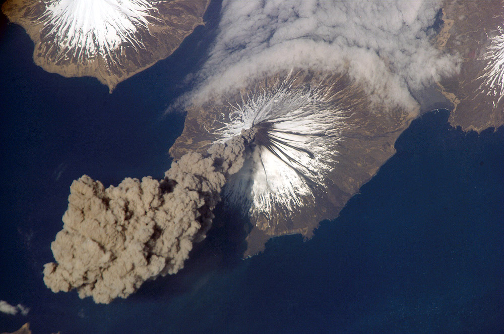
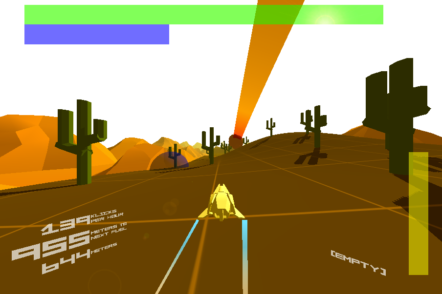
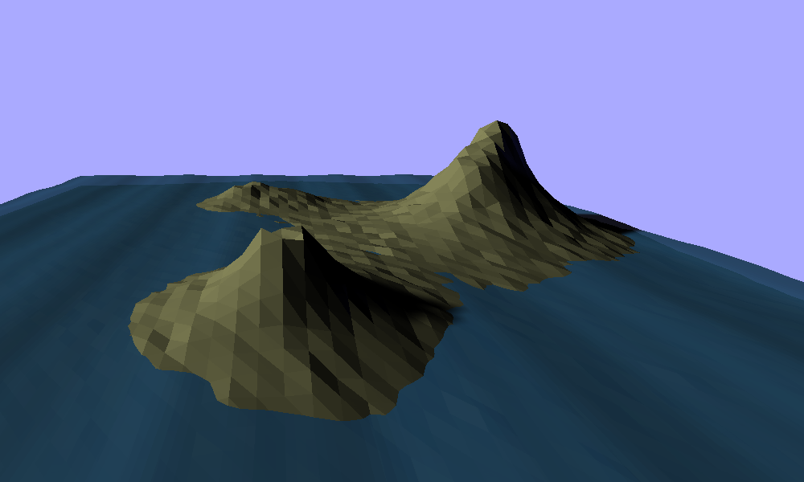
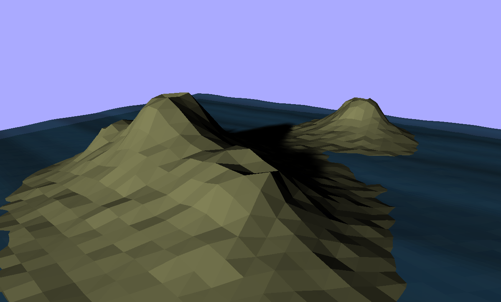

# Throwing Things Out

_Sean Butler_

**I DON'T LIKE PERLIN NOISE.**

There I said it. Gosh I feel better already! Though, this improved feeling does perhaps come at the risk of committing procedural blasphemy*. Of course many procedural developers would say Perlin Noise is incredibly useful, and they'd be right of course.

As a multilayered, scaled, random-ish waveform Perlin Noise can be put to use in many ways. Clouds, Waves, Mountains, Islands, Caves, Lava Lamps, etc. The ease with which Perlin & other similar noise systems generate the kinds of structures listed above is because they can generate an output with a repeating, but never quite the same pattern.

One of the valuable aspect of the algorithm's output is that the variations in the data are all of a similar scale. This similarity of scale allows us to use the output data as source for rolling hills or islands or other features which should all be different, but are created by the same processes so should be of similar scale.

In their vanilla form, the landscapes generated from Perlin noise tend to have a characteristic shape. Luckily for us we can influence that shape. So, most developers put in additional manipulations to create the geographic structures we all enjoy. One particular way is to provide a variable increasing scale on the y-axis. This has the effect of making the higher points of the landscape more pointy. Which more accurately matches the profile of mountains in the world around us.

## Artistry and Authenticity

_ISS Crew Earth Observations experiment and the Image Science &amp; Analysis Group, Johnson Space Center. Public domain via Wikimedia Commons_

Removing the primary physical aspect of a gameplay challenge in making it a simulation based challenge means the space often needs to be amplified for fun to occur, consider the tracks of SSX in comparison with your own experience of skiing, perhaps. Authentic Artefacts often don't make for great video game gameplay.

In authentic artefacts can remind the player they are in a simulation which might not be what you as a designer want. Normalisation, conventions and suspension of disbelief go some way to ameliorate this.

At one end we have arbitrary algorithms and heuristics which generate forms useful in a variety of domains.

At the other end we can have simulations whose internal factors accurately and mathematically replicate the internal states and dynamics of the system found in reality whose aspects we find valuable for our game.

Recently a student I supervised built a system to generate levels for a real-time strategy game. Along with a variety of other techniques, they used a cellular automata to distribute the placement of trees within little forests across the map. While inspired by biology the mathematical features of the cellular automata have little or nothing in common with the systems of pressures on tree populations in the countryside.  

Consider Chris Ofili's use of elephant dung, one could argue that the exact shades he needs for the supports and other round features in his paintings could more easily and cheaply be produced with other materials. Conversely reflect on Damien Hurst's spot paintings, some of which are shipped to their buyer as a series of pots of paint and instructions. Hurst himself states the best spot painting to be had was painted by an assistant. So from the perspective of the artist, and art market the necessity for authenticity is a movable requirement.

Academic or scientific approaches to procedural generation of sand dunes often has the goal of generating natural shaped landscapes.

Meteor Storm Escape acted as a MVP/prototype for a desert dune racing game.

# Tutorial

As we've already seen that due to plate tectonics the thin parts of the earths crust where volcanos can form is often shaped as a long wiggly line.

Manipulate Vectors to steer a random walk where we want it to go.

# Results

In each case the islands generated show convex and concave features around their edges, this is in keeping with authentic natural landscapes, and depending on scale and designer goals could be instrumental in achor detracting from gameplay goals.

The algorithm demonstrated is primarily for the generation of shape, so as such the islands arent rendered with specialist shaders including waters edge, greenery, rock and snow.

# Discussion

Aesthetics of visuals and space in games is different from that in the traditional visual arts. As game developers we must balance the goals of the visual form against the goals of the gameplay form.

In big studio production this is often done by having white/orange boxing and by having gameplay collision mesh built in parallel with the gameplay design and tested against that gameplay as a separate process from the (later) art generation.

In procedural generation the management of this dual nature has to be handled differently. Lots of current procedural generation seems to closely tie or consider identical the visuals and gameplay space.

# Conclusion

---

* A better kind of procedural blasphemy might be an 'electric sinner'. Use logic and NLP to codify the core rule set from a religious text. Build a machine to break those rules (in thought, by visualising them, then perhaps automatically tweeting the images, by communication by inciting others to commit sin and finally in action, would need a robot for this one). Is it possible to carry out any of these activities without actually committing a sin oneself? I suppose we could consider it educational or somewhat like a morality play. (some might say that video games are already doing this)

---
