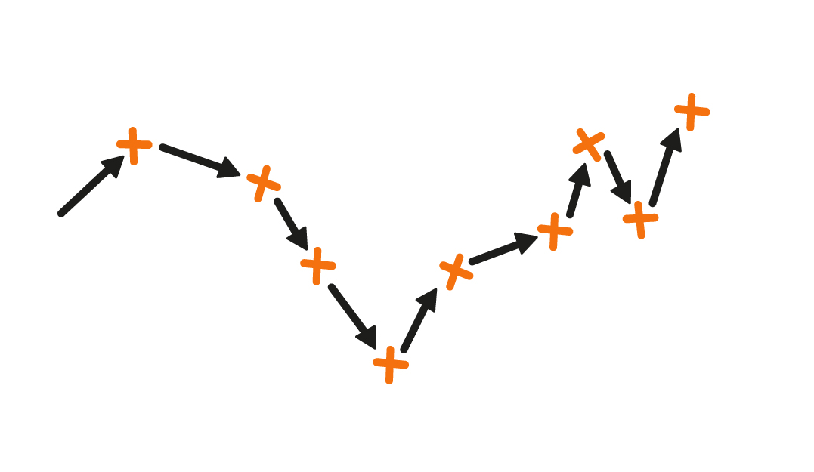
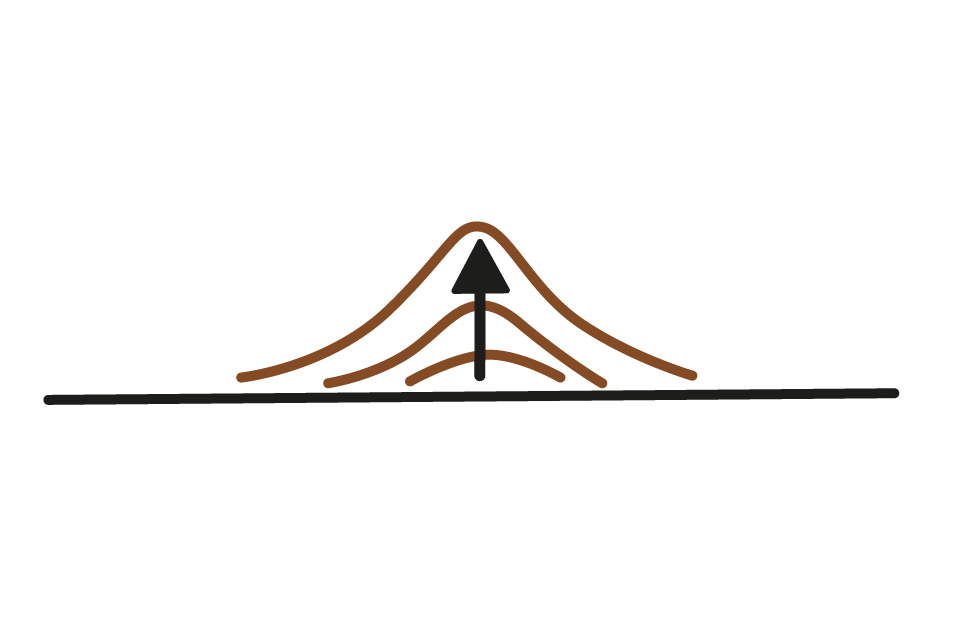

# Throw Perlin Noise Out

_Sean Butler_
sean2.butler@uwe.ac.uk
University of the West of England
Bristol UK

---

__I DON'T LIKE PERLIN NOISE__ There I said it. I feel better already! This improved feeling does perhaps come at the risk of committing procedural blasphemy[^1]. Many procedural developers would say Perlin Noise is incredibly useful and, of course, they'd be right.

## The Problem with Noise

As a multilayered, scaled, random-ish waveform Perlin Noise can be put to use in many ways. Clouds, Waves, Mountains, Islands, Caves, Lava Lamps, Economies, etc. Perlin & other similar noise systems generate these kinds of structures easily because they can generate an output with a repeating, but never quite the same pattern. One of the valuable aspect of the algorithm's output is that the variations in the data can all be of a similar scale. This similarity of scale allows us to use the output as a source for rolling hills or oceanic islands or other features which should all be different, but are created by the same processes so should be of similar scale.

In their vanilla form, the landscapes generated from Perlin noise tend to have a characteristic shape. Luckily for us we can influence that shape. So, most developers put in additional manipulations to create the geographic structures we all enjoy.

One particular way is to provide a variable increasing scale on the y-axis. This has the desirable effect of making the higher points of the landscape more pointy. Which more accurately matches the profiles of mountains and hills in the world around us.

Public Domain, https://commons.wikimedia.org/w/index.php?curid=4152613

Webmaster.vinarice [<a href="https://creativecommons.org/licenses/by-sa/4.0">CC BY-SA 4.0</a>], <a href="https://commons.wikimedia.org/wiki/File:Bacin_zari_2015.jpg">via Wikimedia Commons</a>

## Do Procedural Artefacts even have to be Authentic?

Removing the primary physical aspect of a gameplay challenge in making it a simulation based challenge means the gameplay space often needs to be amplified for fun to occur, consider the tracks of SSX in comparison with your own experience of skiing. Perhaps authentic artefacts don't always make for great video game gameplay?

Inauthentic artefacts can remind the player they are in a simulation and this might not be what you as a designer want. Normalisation, conventions and suspension of disbelief go some way to ameliorate this.

Recently a student I supervised built a system to generate levels for a real-time strategy game. Along with various other techniques, they used a cellular automata to distribute the placement of trees within little forests across the map. While inspired by biology the mathematical features of the cellular automata have little or nothing in common with the systems of pressures on tree populations in the countryside.  

Consider Chris Ofili's use of elephant dung. One could argue that the exact shades he needs for the supports and other round features in his paintings could more easily and cheaply be produced with other materials. Conversely reflect on Damien Hurst's spot paintings, some of which are shipped to their buyer as a series of pots of paint and instructions. Hurst himself states the best spot painting to be had was painted by an assistant. So from the perspective of the artist, and art market the necessity for authenticity is a movable requirement.

Academic or scientific approaches to procedural generation of sand dunes often have the goal of generating natural shaped landscapes. When accurate they can be extremely complex, and result in generation of landscapes which although authentic are not appropriate for gameplay. Journey has extensive dunes and because its gameplay relies on them, uses hand designed landscapes with interpolation and mathematically complex rendering of sand and light to add visual and emotional interest.

In Meteor Storm Escape we included a desert dune racing level among others, at every step of development we compromised any idea of authenticity for a particular challenging and exhilarating player experience.

As developers we all have a choice of strategies, from arbitrary algorithms and heuristics which generate forms useful for gameplay or other reasons, to simulations whose internal factors accurately and mathematically replicate the internal states and dynamics of the system found in reality whose aspects we find valuable for our game.

## An (In)authentic Algorithm to Generate Oceanic Landscapes With Realistic Contours and Gameplay Fit

As we've already seen that due to plate tectonics the thin parts of the earths crust where volcanos form can be shaped as a long wiggly line. Simulations of plate tectonics exist, though I've yet to hear of a game which uses it to determine gameplay[^2]. Its simple enough with a move, turn, loop to manipulate a sequence of vectors to steer a random walk in a particular direction.

Parameterising the length of the vectors and size of change in orientation, we can create a more or less linear (or chaotic) path to represent the place where two parts of the world's crust are moving together or apart.

~~~
var rotation = constAngle * ((Math.random() + Math.random())-1)
Turn (0.0, 1.0, 0.0, rotation)
var distance = constDist * ( 0.5 * (Math.random() + Math.random()))
Move (0.0, 0.0, 1.0, distance)
~~~

Increasing _constAngle_ to a full circle will cause the path to be so wriggly it becomes a pure random walk. Decreasing it to a smaller number will push the random walk off in a direction.

This approach is of course entirely in-authentic in that it bears no relationship with the forces involved in the joining or separating of two tectonic plates. However it _can_ easily be tweaked to produce sequences which either bear a resemblance to the jagged shape of the Mid-Atlantic Ridge or match specific gameplay requirements such as maximum distance between islands.

Throwing out stuff to build the landscape. In a gross simplification lets assume that the direction and velocity of ejecta is completely random, but the random distribution of the angle of ejection follows some variant of a bell curve.

~~~
var angle = (( Math.random() *  Math.PI/2) + ( Math.random() *  Math.PI/2)) /3
var direction = Math.random() * ( 2 * Math.PI)
var velocity = minvel + (Math.random() * 2)
~~~

Adjusting the range and distribution of these values has an impact on the shape of the islands produced. You might prefer more caldera, more sharp jagged peaks etc. Play around and see what you get.

One could run a physics simulation and generate lots of particles and throw them out using an engine's built in physics. This is a good solution quite heavyweight and not always an option on web or mobile. Also we can do the same thing algebraically with one line of code.

We can calculate the approx landing point of the lava which is thrown out of the volcano using a simple equation.

~~~
var distance = ( (velocity * velocity) * Math.sin( 2 * angle ) ) / 10
~~~

This says the distance away that something lands is proportional to the square of its velocity times the sine of the angle it is ejected at, divided by the gravitational acceleration. (The value of 10 is an approximation of gravity which is 9.8 m/s). Of course this is assuming the land is level and the ejection point isnt higher or lower than the landing point. In reality they are changing which would make the calculation more complex. For our purposes this simple approximation is fine.

Now, GCSE trig will translate the distance and direction into a vector offset from the centre of the volcanic island.

~~~
var deltax = Math.sin(direction) * distance;
var deltaz = Math.cos(direction) * distance;
~~~

To which we can then do a little addition on to get a final global position of where the ejecta lands.

~~~
var coords = new THREE.Vector3();
coords.x = Math.floor(centre.x + (deltax * (this.size * 0.5)));
coords.z = Math.floor(centre.z + (deltaz * (this.size * 0.5)));

var meshVertexIndex = ( coords.x * (this.size +1) ) + coords.z;
~~~

As you can imagine our accumulation is incredibly simple, raise the vertex nearest to where it lands!

~~~
var meshVertex = new THREE.Vector3();
meshVertex.fromBufferAttribute( positions, meshVertexIndex );
meshVertex.y += 0.01;
~~~

# Discussion

<!-- 

 -->

Here is a real volcano surrounded by water for comparison.

_ISS Crew Earth Observations experiment and the Image Science &amp; Analysis Group, Johnson Space Center. Public domain via Wikimedia Commons_

In each case the mountains generated have a variety of profiles, sometimes with caldera, sometimes elongated, sometimes pointy and jagged. When in water the islands generated show convex and concave features around their edges. This is in keeping with authentic natural landscapes, and depending on scale and designer goals could be instrumental in achor detracting from gameplay goals.

The algorithm demonstrated is primarily for the generation of shape, so as such the islands arent rendered with specialist shaders or textures including waters edge, greenery, rock and snow etc

The aesthetics of space and visuals in games is different from that in the traditional visual arts. As game developers we must balance the needs of the visual form against the needs of the gameplay form.

In big studio production this is often done by having white/orange boxing and by having gameplay collision mesh built in parallel with the gameplay design and tested against that gameplay as a separate process from the (later) art generation.

In procedural generation the management of this dual nature has to be handled differently. Lots of current procedural generation seems to closely tie or consider identical the visuals and gameplay space.

Authentic and interesting natural structures need addition work on top of the source Perlin Noise. Researchers have developed many high end algorithms for producing authentic natural landscapes. These can be complex to implement and computationally intensive.

Generally for an easy approach to specific landscapes, consider alternatives. Drop the standard dichotomy of Perlin vs Simulation and go for a hybrid approach, build arbitrary authentic algorithms.

As we have seen in the tutorial above, passable approximations are achievable which are lightweight customisable, flexible and easy to understand.

Of particular value is that the maths involved is incrediby simple relying only on some GCSE trig and summed random numbers. The effect of this approach is the system is more tweakable to a human designer. While each input value is perhaps metaphorical, they have a readily understandable effect on the output. Physical simulation approaches (even algebraic ones) are an improvement over traditional noise based approaches because they close the Gulf of Execution commonly associated with complex procedural systems.

[^1]: A better kind of procedural blasphemy might be an 'electric sinner'. Use AI, logic and natural language processing to codify the core rule set from a religious text. Build a machine to break those rules (in thought, by visualising them, then perhaps automatically tweeting the images, by communication by inciting others to commit sin and finally in action, would need a robot for this one). Is it possible to carry out any of these activities without actually committing a sin oneself? I suppose we could consider it educational or somewhat like a morality play. (some might say that video games are already doing this)

[^2]: If anyone knows a bit plate tectonics please, get in-touch, perhaps we can work together?
